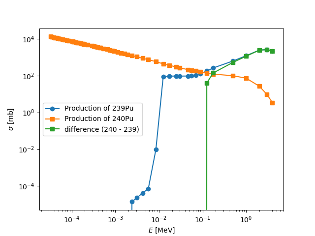

# Prerequisites

**Overview**
1. [Basics in terminal](#basics-in.terminal)
2. [Basic data analysis and plotting](#basic-data-analysis-and-plotting)
3. [TALYS](#TALYS)
4. [Basic github skills](#basic-github-skills)

*Operating system*:
Although not strictly necessary, we recommend to have access to a linux
machine or mac. We will not provide assistance for issues with a Windows
OS. Rather install a Virtual Machine (eg. with Ubuntu 18).

#### Basics in terminal
You should be familiar with basics commands using the terminal, like
`cd`, `ls`, `ls -la`, `less` and `chmod`. If you are not familiar with
it yet, see these two links: [Learning about Terminal 1](https://medium.com/datadriveninvestor/learning-programming-part-1-what-is-a-terminal-window-e2dcde4e0cf5)
 and [Programmer's Survival Guide](https://www.ntu.edu.sg/home/ehchua/programming/howto/Unix_SurvivalGuide.html)

Please make sure that you also know how to edit even *hidden* files of
your OS, like the `.bash_profile` or [`.bashrc`](https://unix.stackexchange.com/questions/129143/what-is-the-purpose-of-bashrc-and-how-does-it-work) files.

#### Basic data analysis and plotting
You should be able to read tabulated data and with basic data
manipulations, like finding and plotting the difference between two
columns.
There are two example data files on this repo: [rp094239.tot](rp094239.tot) and [rp094240.tot](rp094240.txt)
The data is tabulated with the energy `E` in MeV and the cross section `σ` in mb.
 - Create a plot like the following below, where you plot both datasets and their
difference, including axis titles, the axis on log scale and a legend.

We are not enforcing that you analyze data in a certain language, but if
you have difficulties to perform the above mentioned tasks, we recommend
you to have a look as `python3` with `numpy` and `matplotlib`. See these
totorials: [learnpython.org](https://www.learnpython.org/), [matplotlib](https://matplotlib.org/users/pyplot_tutorial.html), and [Numpy Quick](https://towardsdatascience.com/a-quick-introduction-to-the-numpy-library-6f61b7dee4db)

#### TALYS
Try to download and compile the latest version of [TAYLS](http://www.talys.eu/home/). Please try yourself first and/or ask your friends, but we may help you during the summer school if you really don't succeed. Google you problems before you come to us, because probably, we'll just google them, too.

#### Basic github skills
You should be able to create, clone and contribute to github repositories. See the two links below for short introduction: [create-a-repo](https://help.github.com/en/articles/create-a-repo) and [Github from command Line](
https://help.github.com/en/articles/adding-an-existing-project-to-github-using-the-command-line). There are also desktop version [GitHub Desktop](https://help.github.com/en/desktop) if you prefer this.

In this course, we will probably upload some data via [git lfs](https://git-lfs.github.com/). Please make sure you have installed it. You can check this very easily. Clone the repository and try to read the content of a file called `git_lfs_file.txt` in this folder. If you can read the text (proper sentences), you have setup git lfs correctly.
